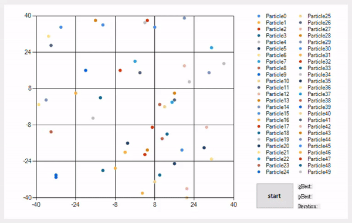
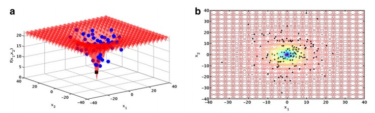

# Particle swarm optimization (PSO) with C#

### Minimize Ackley Function with two variables.

### Reference to:

Federico Marini, Beata Walczak., Particle swarm optimization (PSO). A tutorial., Chemometrics and Intelligent Laboratory Systems., Volume 149, Part B., 2015., Pages 153-165., ISSN 0169-7439.,[https://doi.org/10.1016/j.chemolab.2015.08.020](https://doi.org/10.1016/j.chemolab.2015.08.020).

